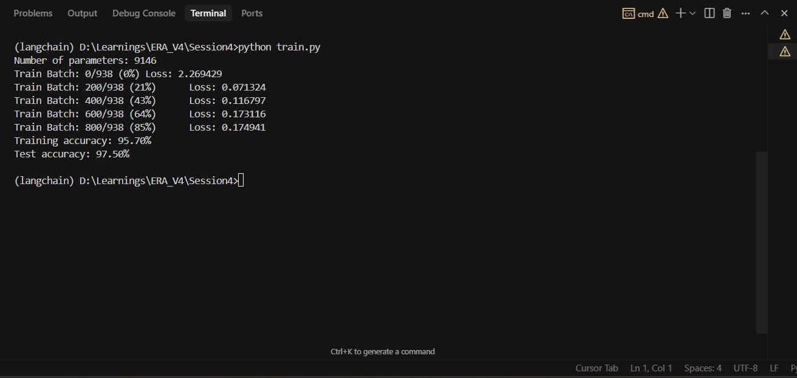

# MNIST Classifier

A PyTorch implementation of a lightweight CNN for MNIST digit classification that achieves >95% accuracy in a single epoch with less than 25,000 parameters.

## Model Architecture

The model uses a lightweight CNN architecture optimized for quick learning:

1. **Convolutional Layers**:
   - First layer: 8 filters to capture basic features
   - Second layer: 16 filters for more complex patterns
   - Each followed by batch normalization and max pooling

2. **Batch Normalization**:
   - Added after each conv layer
   - Helps with faster convergence
   - Stabilizes training

3. **Parameter Efficiency**:
   - Minimal number of filters (8→16)
   - Single fully connected layer

   - First conv layer: 80 parameters
   - First batch norm: 16 parameters
   - Second conv layer: 1,168 parameters
   - Second batch norm: 32 parameters
   - Final FC layer: 7,850 parameters
   - Total: 9,146 parameters

4. **Optimizer**: SGD with Nesterov Momentum
   - Learning rate: 0.02
   - Momentum: 0.9
   - Nesterov: True

## Logs

Logs generated during training:

